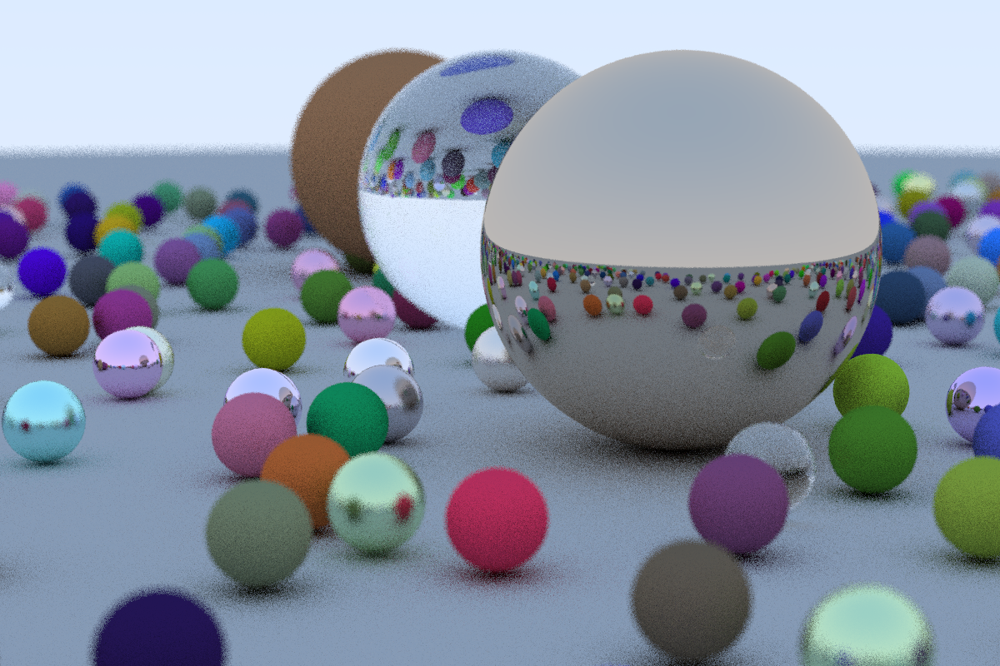
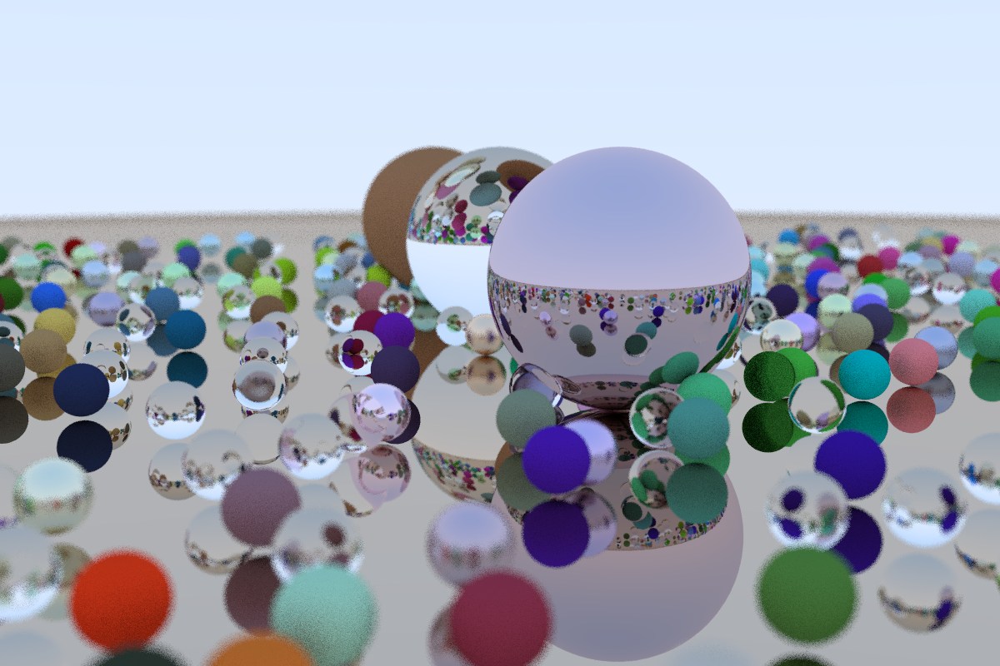

# CudaRaytracing in One Weekend

|      | image                   | time    |
| ---- | ----------------------- | ------- |
| cpu  |    | 70.77s  |
| cuda |  | 24.2271 |

## Reference

1. [Ray Tracing in One Weekend](https://github.com/RayTracing/raytracing.github.io)
2. [Ray Tracing in One Weekend in CUDA](https://github.com/rogerallen/raytracinginoneweekendincuda)
